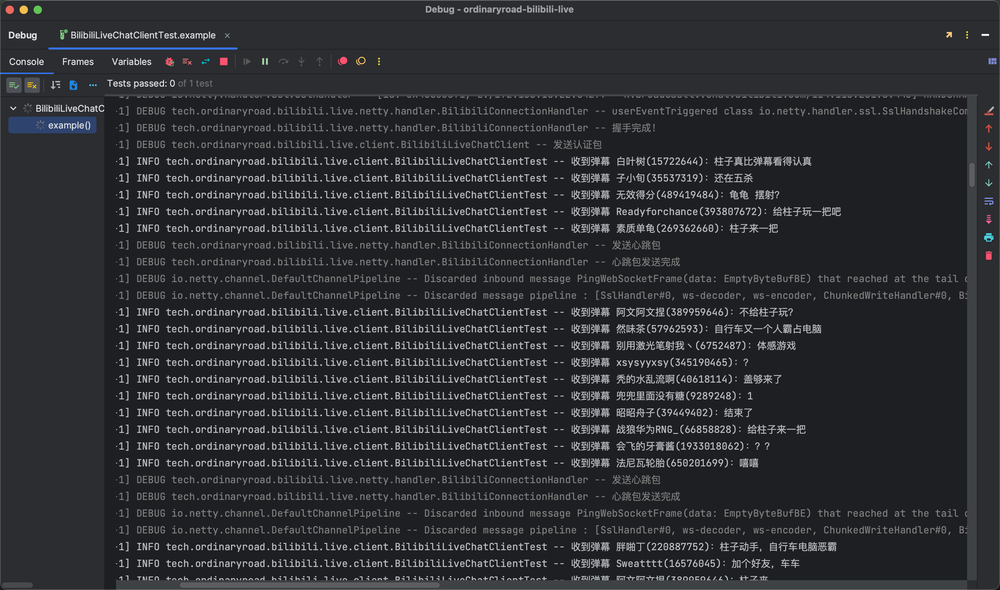

# ordinaryroad-bilibili-live

  

使用Netty来连接B站直播间的弹幕信息流Websocket接口

## ⚠️⚠️⚠️ 项目已重构（API不变，v0.0.9为最后一个版本），已支持Bilibili、Douyu、Huya、Douyin、Kuaishou，传送门：[ordinaryroad-live-chat-client](https://github.com/OrdinaryRoad-Project/ordinaryroad-live-chat-client)，有问题欢迎[提交issuse](https://github.com/OrdinaryRoad-Project/ordinaryroad-live-chat-client/issues)，觉得有用的话可以点个小星星⭐️鼓励一下，感谢


- Feature 0: Netty
- Feature 1: 消息中的未知属性统一放到单独的MAP中
- Feature 2: 支持房间短id
- Feature 3: 支持自动重连
- Feature 4: 支持Cookie
- Feature 5: 支持同时监听多个直播间

> ☑️ ✅ ToDo
> List: https://github.com/users/1962247851/projects/1/views/1?filterQuery=repo%3A%22OrdinaryRoad-Project%2Fordinaryroad-bilibili-live%22

### 1. 引入依赖

```xml

<dependency>
    <groupId>tech.ordinaryroad.bilibili.live</groupId>
    <artifactId>ordinaryroad-bilibili-live</artifactId>
    <!-- 参考github release版本，不需要前缀`v` -->
    <version>${ordinaryroad-bilibili-live.version}</version>
</dependency>
```

### 2. 开始使用
> Spring Boot 3示例项目：https://github.com/OrdinaryRoad-Project/ordinaryroad-bilibili-live-example

#### 2.1 Client模式

> 参考`BilibiliLiveChatClientTest`测试类
```java
String cookie = System.getenv("cookie");
BilibiliLiveChatClientConfig config = BilibiliLiveChatClientConfig.builder()
    // TODO 浏览器Cookie
    .cookie(cookie)
    .roomId(7777)
    .build();

client = new BilibiliLiveChatClient(config, new IBilibiliSendSmsReplyMsgListener() {
    @Override
    public void onDanmuMsg(SendSmsReplyMsg msg) {
        JsonNode info = msg.getInfo();
        JsonNode jsonNode1 = info.get(1);
        String danmuText = jsonNode1.asText();
        JsonNode jsonNode2 = info.get(2);
        Long uid = jsonNode2.get(0).asLong();
        String uname = jsonNode2.get(1).asText();
        log.info("收到弹幕 {}({})：{}", uname, uid, danmuText);
    }
});
client.connect();
```

#### 2.2 高级模式

> 参考`BilibiliBinaryFrameHandlerTest`测试类

重写`IBilibiliSendSmsReplyMsgListener`中的方法，进行处理业务逻辑（耗时操作可能需要异步）

> 修改相关参数后，运行查看效果
```java
    // TODO 修改房间ID
    long roomId = 7777;
    // TODO 设置浏览器Cookie
    String cookie = System.getenv("cookie");
    // TODO 修改版本
    ProtoverEnum protover = ProtoverEnum.NORMAL_BROTLI;
```

> 控制台输出示例


> CmdEnum可能不全，需要根据控制台信息手动补（不影响运行）

### 相关链接

- [B站直播数据包分析连载（2018-12-11更新）_weixin_34009794的博客-CSDN博客](https://blog.csdn.net/weixin_34009794/article/details/88689474)
- [获取bilibili直播弹幕的WebSocket协议_炒鸡嗨客协管徐的博客-CSDN博客](https://blog.csdn.net/xfgryujk/article/details/80306776)
- [GitHub - SocialSisterYi/bilibili-API-collect: 哔哩哔哩-API收集整理【不断更新中....】](https://github.com/SocialSisterYi/bilibili-API-collect)
- [GitHub - LiQing-Code/BLiveDanmu: 用于获取哔哩哔哩直播间弹幕数据](https://github.com/LiQing-Code/BLiveDanmu)
- [Java 使用zlib压缩和解压字符_、Pacific的博客-CSDN博客_java zlib](https://blog.csdn.net/qq_42670703/article/details/123370008)
- [https://s1.hdslb.com/bfs/blive-engineer/live-web-player/room-player.min.js](https://s1.hdslb.com/bfs/blive-engineer/live-web-player/room-player.min.js)
- [哔哩哔哩直播开放平台 (bilibili.com)](https://open-live.bilibili.com/)
- [哔哩哔哩开放平台 (bilibili.com)](https://openhome.bilibili.com/)
- [哔哩哔哩直播开放文档 (bilibili.com) 长连CMD说明](https://open-live.bilibili.com/document/f9ce25be-312e-1f4a-85fd-fef21f1637f8)
- [bilibili直播间接收监听和发送弹幕api\_b站弹幕api\_NPC\_P的博客-CSDN博客](https://blog.csdn.net/npccccccccc/article/details/124576745)
- [感谢大佬，B站弹幕也能抓取啦\~ - 51Testing软件测试网-软件测试人的精神家园](http://www.51testing.com/mobile/view.php?itemid=4475284)
- [Bilibili-Live-API/API.WebSocket.md at master · lovelyyoshino/Bilibili-Live-API · GitHub](https://github.com/lovelyyoshino/Bilibili-Live-API/blob/master/API.WebSocket.md)
